# AI Product Manager

## Udacity | Bertelsmann

# Project Proposal
# Google AutoML (Predicting Pneumonia from Chest XRay)
# AutoML Modeling Report

#### Aswin Vijayakumar

## Binary Classifier with Clean/Balanced Data

### Train/Test Split

How much data was used for training? How much data was used for testing?

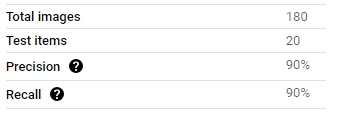

#### Answer: 

The AutoML program did automatic train/test split

Training: 160 images

Test: 20 images

Validation: 20 images

These images used 50% of normal and 50% of pneumonia XRAYs out of total images labelled

### Confusion Matrix 

What do each of the cells in the confusion matrix describe? What values did you observe (include a screenshot)? What is the true positive rate for the “pneumonia” class? What is the false positive rate for the “normal” class?

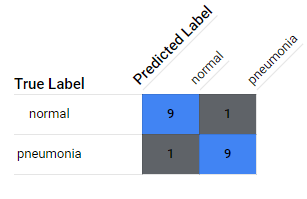

#### Answer: 

The confusion matrix given above is the screenshot from AutoML of XRAY images of pneumonia and normal.

**For normal:**

- The predicted true for normal (true negative) says there is 90% of images which are predicted
correctly and the result is negative.

- The predicted false for normal (false positive) says there is 10% of images which are predicted wrongly and the result is positive.

**For pneumonia:**

- The predicted true for pneumonia (true positive) says there is 90% of images which are predicted correctly and the result is positive.

- The predicted false for pneumonia (false negative) says there is 10% of images which are predicted wrongly and the result is negative.

True Positive Rate, TPR (pneumonia) = 90% = 0.9

False Positive rate, FPR (normal) = 10% = 0.1

### Precision and Recall

What does precision measure? What does recall measure? What precision and recall did the model achieve (report the values for a score threshold of 0.5)?

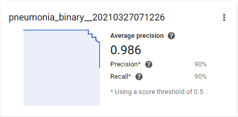

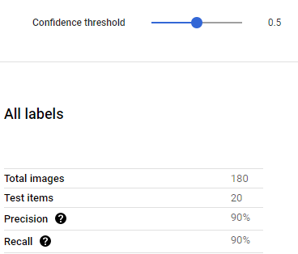

#### Answer: 

Precision = 0.9

Recall = 0.9

Precision is the ratio of True Positives and Total Positives. It says out of all positive predictions how many have the prediction algorithm predicted correctly.

Recall is the True Positive Rate, i.e, Recall is out of correct labels how many have been predicted correctly.

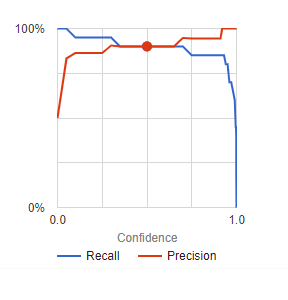

When the score threshold is increased, the precision increases and recall decrease as seen from the graph.
This is because a greater threshold will include more images from the training set thereby increasing the precision and reducing the recall

### Score Threshold

When you increase the threshold what happens to precision? What happens to recall? Why?

#### Answer: 

When the score threshold is increased:

Precision = TP / (TP + FP)

Recall = TP / (TP + FN)

As per the above formula, when the confidence threshold of the model increases, the number of errors it commits decreases, which reduce the False Positives (FP). Since the denominator decreases, the precision increases.

Now for recall, when the confidence threshold is increased, the correctly classified elements increase and hence the True Positives increase so the numerator and denominator increase and hence the recall decreases.

## Binary Classifier with Clean/Unbalanced Data

### Train/Test Split

How much data was used for training? How much data was used for testing?

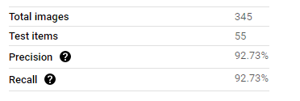

#### Answer: 

The AutoML program did automatic train/test split

There are 100 normal and 300 pneumonia images out of total 400 images labelled

Training: 345 Images

Testing: 55 images

For normal, 10 images were each used for validation and testing and 80 images were used for training

For pneumonia, 45 images were each used for validation and testing and 210 images were used for training

### Confusion Matrix

How has the confusion matrix been affected by the unbalanced data? Include a screenshot of the new confusion matrix.

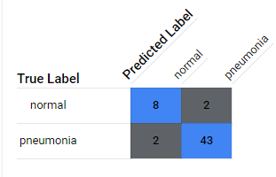

#### Answer: 

By including more data in pneumonia, the ratio of false negatives are reduced to 4% from 10%.
For normal, the confusion matrix elements such as True Negatives and False positives reduce for True Negatives and increase for False Positive

### Precision and Recall

How have the model’s precision and recall been affected by the unbalanced data (report the values for a score threshold of 0.5)?

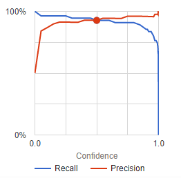

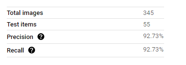

#### Answer: 

Precision: 92.73%

Recall: 92.73%

Precision and Recall have both been increased.

### Unbalanced Classes

From what you have observed, how do unbalanced classed affect a machine learning model?

#### Answer: 

Introducing Attribution Bias for label categories in the data will result in alteration of True Positives and True Negatives as observed in our result from previous result.

When the algorithm predicts more of positives than negatives the prediction probability will lie more towards positives than negatives.

When the prediction probability changes the recall changes because the model becomes more sensitive towards that label.

Alternatively, the specificity of the model, when less negatives are trained as compared to positives, will decrease.

## Binary Classifier with Dirty/Balanced Data

### Confusion Matrix

How has the confusion matrix been affected by the dirty data? Include a screenshot of the new confusion matrix.

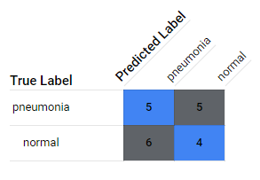

#### Answer: 

Confusion matrix has become more even and is almost 50% for all: true positives, true negatives, false negatives and false positives.

More items have moved from correctly classifying to wrongly classify. Such movement is due to the misplacement of wrong attributed images into each label category.

### Precision and Recall

How have the model’s precision and recall been affected by the dirty data (report the values for a score threshold of 0.5)? Of the binary classifiers, which has the highest precision? Which has the highest recall?

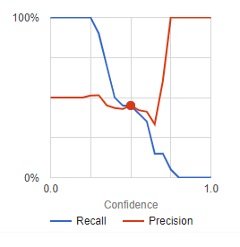

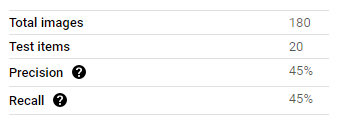

#### Answer: 

The precision and recall have both been reduced due to errors in data. Greater the errors greater is the difference between old precision and new precision. Considering the error function within the machine learning model, the errors create a steady downward trend towards precision and recall at a score threshold of 0.5.

The model with clean and unbalanced data show highest precision and the model with clean and unbalanced data also shows highest recall.

### Dirty Data

From what you have observed, how does dirty data affect a machine learning model?

#### Answer: 

The dirty data creates errors in the machine learning model and affect the error function within the machine learning model. This could be called as classification uncertainty, plain error function which could be mathematically represented using a parameter or skewness of the ground-truth in the population. Such data has bias: could be termed as attribution bias, classification / categorical bias, algorithm bias and selection bias.

## 3-Class Model

### Confusion Matrix

Summarize the 3-class confusion matrix. Which classes is the model most likely to confuse? Which class(es) is the model most likely to get right? Why might you do to try to remedy the model’s “confusion”? Include a screenshot of the new confusion matrix.

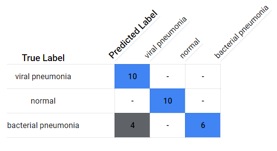

Class that is Most likely to confuse is Bacterial Pneumonia.

Classes most likely to get right are:
- Normal
- Viral Pneumonia

Predictions of Bacterial Pneumonia are very confusing to viral Pneumonia as well as bacterial pneumonia ones do have several small cloudy areas. But almost all viral pneumonia XRAY images look the same.

The question you ask an annotator is:
- Whether there are several small cloudy areas, and/or
- Whether there is a distinct cloudiness in the XRAY image

Looking at the questions the above statement about bacterial pneumonia and the model’s confusion also states normal ones are pretty much having a clarity and the viral ones are distinguishable.

Bacterial Pneumonia has only 100 samples, so adding more training samples to the data for the bacterial Pneumonia and more samples to viral and normal and increase test and validation sets in order to prevent overfit is one method to remedy the situation. (as I’m not 100% happy with the 100% on confusion matrix with viral pneumonia and normal)

Since bacterial pneumonia look different and some look similar to viral pneumonia, adding more samples of those XRAYs that look similar is a solution.
Improve the training techniques by providing more annotated data that distinguishes between bacterial pneumonia and viral pneumonia.

### Precision and Recall

What are the model’s precision and recall? How are these values calculated (report the values for a score threshold of 0.5)?

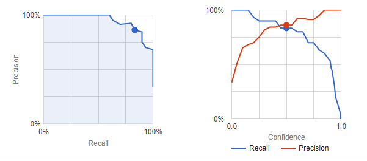

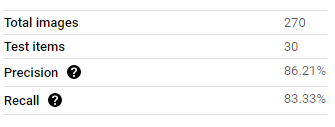

#### Answer: 

Precision = 86.21%

Recall = 83.33%

Recall is Sensitivity or True Positive Rate

Precision is model’s prediction capability in positive labels. It says Out of all positive predictions how many
have shown correctness.

Precision = TP / (TP + FP)

Recall = TP / (TP + FN)

The above formula is how the model’s precision and recall are calculated. This formula is applied to each class of the model: viral pneumonia, bacterial pneumonia and normal.

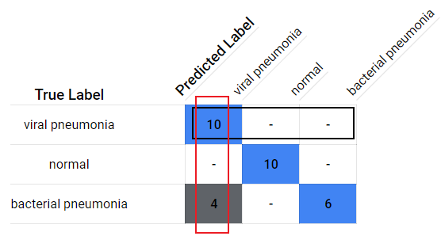

The one that comes across in this figure is comparing the chosen label with other labels in prediction results implying the true label is always positive. Hence that one is Recall.

The one that comes down (marked red) by inference is obviously Precision.

They are calculated by ratio of sums, the true positive on the numerator and the sum of the values within the box in the denominator which applies for both.

### F1 Score

What is this model’s F1 score?

F1 score is the harmonic mean of precision and recall.

1 / F1 score = (1/Precision + 1/Recall ) / 2

F1 Score = 0.8475

